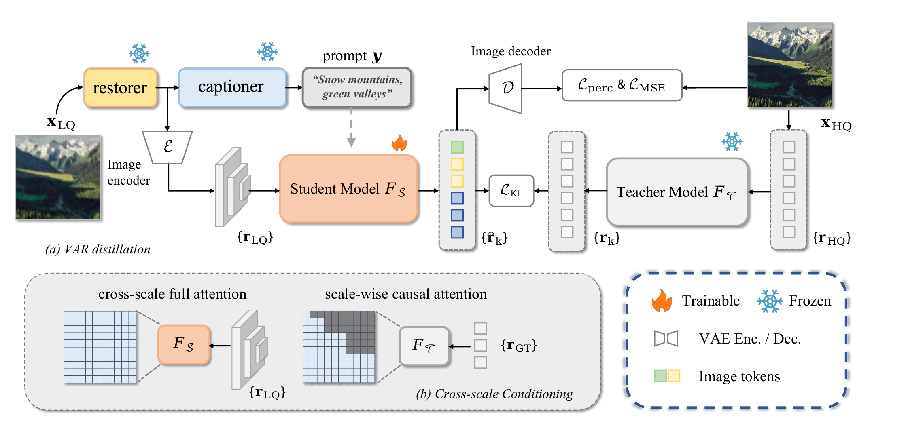

# VARestorer: One-Step VAR Distillation for Real-World Image Super-Resolution (ICLR 2026)

<div align="center">
  
</div>

<div align="center">

**[Yixuan Zhu\*](https://eternalevan.github.io/), [Shilin Ma\*](https://github.com/cyp336/), [Haolin Wang](https://howlin-wang.github.io/), [Ao Li](https://rammusleo.github.io/), Yanzhe Jing, [Yansong Tang†](https://andytang15.github.io/), [Lei Chen](https://andytang15.github.io/), [Jie Zhou](https://scholar.google.com/citations?user=6a79aPwAAAAJ&hl=en&authuser=1), [Jiwen Lu](http://ivg.au.tsinghua.edu.cn/Jiwen_Lu/)**
<!-- <br> -->
(\* Equal contribution &nbsp; † Corresponding author)

Tsinghua University
</div>

[**[Paper]**](https://openreview.net/pdf?id=T2Oihh7zN8)

The repository contains the official implementation for the paper "VARestorer: One-Step VAR Distillation for Real-World Image Super-Resolution" (**ICLR 2026**).

We propose VARestorer, a simple yet effective distillation framework that transforms a pre-trained text-to-image VAR model into a one-step ISR model.

## 📋 To-Do List

* [x] Release model and inference code.
* [x] Release paper.


## 💡 Pipeline




## 😀Quick Start
### ⚙️ 1. Installation

We recommend you to use an [Anaconda](https://www.anaconda.com/) virtual environment. If you have installed Anaconda, run the following commands to create and activate a virtual environment.
``` bash
conda create -n varestorer python==3.11.0
conda activate varestorer

git clone https://github.com/EternalEvan/VARestorer.git

cd VARestorer
pip install -r requirements.txt
pip install --no-build-isolation git+https://github.com/cloneofsimo/lora.git
pip install --no-build-isolation flash_attn==2.8.3
```

### 🗂️ 2. Download Checkpoints

Please download our pretrained [checkpoint](https://drive.google.com/file/d/1NkwlvNfr7nOkN45VWmO-PXbJZ8Nkt2_l/view?usp=drive_link), [flan-t5-xl](https://huggingface.co/google/flan-t5-xl), [swinir](https://huggingface.co/lxq007/DiffBIR/blob/main/general_swinir_v1.ckpt), [infinity_vae](https://huggingface.co/FoundationVision/Infinity/blob/main/infinity_vae_d32reg.pth)  and put them under `./weights`. The file directory should be:

```
|-- weights
|--|-- flan-t5-xl
|--|-- general_swinir_v1.ckpt
|--|-- infinity_vae_d32reg.pth
|--|-- varestorer.pth
...
```

### 📊 3. Run Inference

You can run inference with following commands:

```bash
bash scripts/infer.sh
```

You can use `--tiled` for patch-based inference and use `--sr_scale` to set the super-resolution scale, like 2 or 4. You can set `CUDA_VISIBLE_DEVICES=1` to choose the devices.

The inference process can be done with one Nvidia GeForce RTX 3090 GPU (24GB VRAM). You can use more GPUs by specifying the GPU ids.


## 🫰 Acknowledgments

We would like to express our sincere thanks to the authors of [Infinity](https://github.com/FoundationVision/Infinity), [DiffBIR](https://github.com/XPixelGroup/DiffBIR), [OSEDiff](https://github.com/cswry/OSEDiff) for open-sourcing their code. 

## 🔖 Citation
Please cite us if our work is useful for your research.

```
@inproceedings{zhu2026varestorer,
  title={VARestorer: One-Step VAR Distillation for Real-World Image Super-Resolution},
  author={Yixuan Zhu and Shilin Ma and Haolin Wang and Ao Li and Yanzhe Jing and Yansong Tang and Lei Chen and Jiwen Lu and Jie Zhou},
  booktitle={International Conference on Learning Representations (ICLR)},
  year={2026},
  url={https://openreview.net/forum?id=T2Oihh7zN8}
}
```
## 🔑 License

This code is distributed under an [MIT LICENSE](./LICENSE).